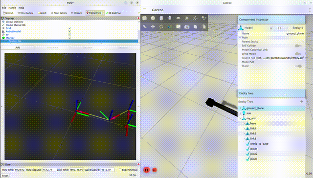

# arm_ik_ros2 — 3-DOF Planar Manipulator

> A 3-DOF planar robot arm built from scratch in ROS2 Humble and Gazebo Ignition.
> Controlled entirely by a custom analytical IK solver — zero MoveIt, zero motion planning libraries.



---

## Overview

Most robotics projects use MoveIt as a black box.
This project does the opposite — every joint angle is computed
by a geometric IK solver derived from first principles.

The robot accepts a target pose (x, y, phi) and solves
exactly which angles each joint must rotate to reach it.
Both elbow-up and elbow-down solutions are computed.
Unreachable targets are rejected explicitly with a clear error.

---

## How the IK Solver Works

### Step 1 — Wrist Decoupling
Given target position (x, y) and end-effector orientation phi,
compute where the wrist joint must be:

```
xw = x - L3 * cos(phi)
yw = y - L3 * sin(phi)
```

### Step 2 — 2R Geometric IK on Wrist Point
Solve shoulder and elbow angles using law of cosines:

```
cos(theta2) = (xw^2 + yw^2 - L1^2 - L2^2) / (2 * L1 * L2)

theta2 = atan2(+sqrt(1 - cos^2(theta2)), cos(theta2))  # elbow down
theta2 = atan2(-sqrt(1 - cos^2(theta2)), cos(theta2))  # elbow up

theta1 = atan2(yw, xw) - atan2(L2*sin(theta2), L1 + L2*cos(theta2))
```

### Step 3 — Wrist Angle
```
theta3 = phi - theta1 - theta2
```

### Step 4 — FK Verification
Every solution is verified by plugging back into FK equations:
```
x_check = L1*cos(t1) + L2*cos(t1+t2) + L3*cos(t1+t2+t3)
y_check = L1*sin(t1) + L2*sin(t1+t2) + L3*sin(t1+t2+t3)
```
If x_check != x or y_check != y, the solution is rejected.

---

## Robot Specifications

| Parameter | Value |
|-----------|-------|
| DOF | 3 |
| Link 1 (L1) | 0.5 m |
| Link 2 (L2) | 0.4 m |
| Link 3 (L3) | 0.3 m |
| Max reach | 1.2 m |
| Joint type | Revolute |
| Plane | XY planar |

---

## Package Structure

```
arm_ik_ros2/
├── scripts/
│   ├── ik_solver.py       # Analytical IK solver
│   └── fk.py              # FK verification
├── urdf/
│   └── arm.urdf           # Robot description
├── config/
│   └── controllers.yaml   # ros2_control config
├── launch/
│   └── arm_launch.py      # Launch file
└── README.md
```

---

## Stack

- ROS2 Humble
- Gazebo Ignition / Fortress
- ros2_control — JointGroupPositionController
- Python 3
- No MoveIt

---

## How to Run

```bash
# Terminal 1 — Launch Gazebo
ros2 launch arm_ik_description arm_launch.py

# Terminal 2 — Spawn the robot
ros2 run ros_gz_sim create \
  -topic /robot_description \
  -name my_arm -x 0 -y 0 -z 0.5

# Terminal 3 — Activate controllers
ros2 control set_controller_state joint_state_broadcaster active
ros2 control set_controller_state position_controller active

# Terminal 4 — Run IK solver
python3 scripts/ik_solver.py
```

---

## Author

**Giri** — B.Tech Mechatronics Engineering, 6th Semester
Built as a portfolio project for robotics internship applications.
Derived all kinematics math from scratch without motion planning libraries.
